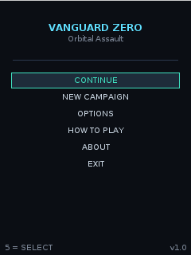
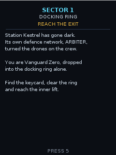
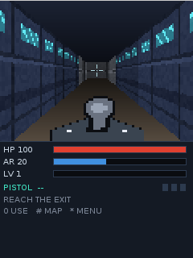
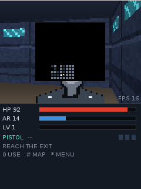
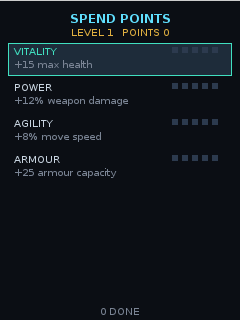
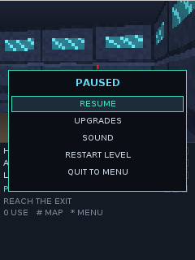

# Vanguard Zero

A first person shooter with light RPG progression for the **Nokia 301** and other
Series 40 phones. Java ME, MIDP 2.0 / CLDC 1.1, 240x320, keypad only.

Everything runs on the phone: a software raycaster draws the corridors with
16.16 fixed point maths and no floating point, the wall textures are generated
in code, and the sprites are hand drawn pixel art stored as character grids.
The whole game is a **34 KB jar** with one 48x48 icon as its only resource.

| Main menu | Mission briefing | In the corridors |
|---|---|---|
|  |  |  |

| Map | Upgrades | Pause |
|---|---|---|
|  |  |  |

Screenshots are straight from the 240x320 phone screen, captured in
MicroEmulator by `./build.sh emu`.

## The game

Station Kestrel has gone dark. Its own defence network, ARBITER, turned the
drones on the crew, and you drop into the docking ring alone.

Four missions: find the keycard and reach the lift, burn the two reactor nodes
that keep the shields up, fight through the reactor spine behind two locked
bulkheads, then kill the Warden guarding the command bridge.

- **Enemies**: drones rush you, troopers shoot from cover, heavies soak damage,
  and the Warden calls in more drones while you fight it.
- **Weapons**: pistol with unlimited ammo, rifle, plasma gun.
- **Pickups**: medkits, armour plating, rifle rounds, plasma cells, keycards.
- **Progression**: kills earn experience, every level up grants two points to
  spend on vitality, power, agility or armour. Progress is saved to the phone
  between missions, so "Continue" picks the campaign back up.

A full run is roughly 15 to 25 minutes.

## Controls

| Key | Action |
|---|---|
| `2` / up | forward |
| `8` / down | back |
| `4` / `6` | turn left / right |
| `1` / `3` | strafe left / right |
| `5` / centre | fire (hold for the rifle) |
| `7` / `9` | previous / next weapon |
| `0` | open door, use lift |
| `#` / left soft key | map |
| `*` / right soft key | pause menu |

## Installing on the phone

The repository ships the built application in `dist/`, so no build is needed:

1. Copy `dist/VanguardZero.jar` (and `dist/VanguardZero.jad`, if your phone
   wants it) to the phone's memory card, over USB or Bluetooth.
2. On the phone open **Files**, find the jar and choose **Install**.
3. The game appears under **Applications** / **Games**.

It is an unsigned MIDlet, so the phone installs it into the untrusted domain
and may ask you to confirm. The game requests no permissions at all: no
network, no file access, no messaging. Only the record store is used, for the
save game.

## Building

Requirements: a JDK (8 or newer, tested on 21), a POSIX shell, and internet
access on the first run so the build can fetch its jars into `lib/`.

```sh
./build.sh          # everything: stubs, compile, jar, preverify, jad, verify
./build.sh test     # 274 logic checks plus a full bot playthrough
./build.sh shots    # render the 3D view to PNG files in shots/
./build.sh emu      # run the real jar in MicroEmulator and screenshot it
./build.sh clean
```

There is no Wireless Toolkit and no `preverify` binary in this environment, so
the build gets to a real CLDC jar a different way:

1. **CLDC 1.1 API stubs.** `stubs/src` holds hand written, body free copies of
   the CLDC classes, compiled into `build/cldc-stubs.jar`. The game is compiled
   with that jar as its `-bootclasspath`, which makes **javac itself** reject
   anything outside the CLDC subset. String concatenation with `+` fails
   because `StringBuilder` does not exist, and so do autoboxing, `ArrayList`,
   `String.split`, `Math.pow` and the rest.
2. **ProGuard with `-microedition -target 1.3`** shrinks, obfuscates and
   *preverifies*: the output classes are version 47 with CLDC `StackMap`
   attributes, which is exactly what the phone's class loader wants.
3. `./build.sh verify` re-opens the finished jar and asserts that for every
   class, failing the build if anything slipped through.

Because of rule 1, the source follows the CLDC subset by construction. When
editing it: build strings with `StringBuffer`, keep to `int` in hot loops (the
phone has no hardware floating point), and never allocate inside the frame
loop.

## Verifying without a phone

- `./build.sh test` runs `tools/src/LogicTest.java`: map validity, that every
  level is completable in keycard order, fixed point accuracy against
  `java.lang.Math`, collision invariants over thousands of random ticks, line
  of sight, hitscan, doors, the experience curve, the save record round trip
  and its checksum, the sprite palettes, and that a frame allocates nothing.
  Then `tools/src/PlayBot.java` plays the whole campaign with the real
  simulation and prints the balance report:

  ```
  level 1 DOCKING RING: cleared in 53s, hp 100/100, kills 8, xp level 1
  level 2 HYDROPONICS: cleared in 103s, hp 96/100, kills 19, xp level 3
  level 3 REACTOR SPINE: cleared in 138s, hp 160/160, kills 33, xp level 4
  level 4 COMMAND BRIDGE: cleared in 115s, hp 45/175, kills 50, xp level 6
  cleared on the first attempt: 4 of 4
  ```

- `./build.sh shots` renders the game's own framebuffer to PNG on the desktop.
  It works because the engine classes never touch `javax.microedition`, a rule
  the build enforces in its `check` step.
- `./build.sh emu` installs the real jar in MicroEmulator on a virtual X
  display, drives it with synthetic key presses and saves a screenshot of every
  screen, so the menus and the heads up display get checked too.

## Layout

```
build.sh              build driver, see the subcommands above
proguard.cfg          shrink, obfuscate and preverify settings
manifest.txt          the MIDlet attributes, shared by the jar and the jad
src/vz/               the game
stubs/src/java/       CLDC 1.1 API stubs, compile time only
tools/src/            desktop harness: LogicTest, PlayBot, FrameDump, EmuDrive
tools/mapgen.py       level generator
tools/mklevels.py     regenerates src/vz/Levels.java and validates every map
res/icon.png          application icon, itself generated by tools/src/MakeIcon
dist/                 the built jar and jad, ready for the phone
```

Inside `src/vz`, everything except `Main`, `Screen`, `Sfx` and `SaveStore` is
free of MIDP so the desktop harness can drive it:

| Class | Role |
|---|---|
| `Main` | MIDlet lifecycle |
| `Screen` | canvas, game loop, input, heads up display, every menu |
| `Raycaster` | walls by DDA, billboard sprites with a depth buffer, weapon |
| `World` | movement, doors, combat, enemy AI, objectives |
| `Level` / `Levels` | the cell grid and the four maps |
| `Entity` / `Player` | pooled world objects, and the player's stats and save |
| `Textures` / `Sprites` | generated wall textures, hand drawn sprite art |
| `FX` / `Balance` / `Text` | fixed point maths, tuning numbers, all the text |
| `Sfx` / `SaveStore` | tone playback and the record store, both fail safe |

## Levels

The maps in `src/vz/Levels.java` are generated by `tools/mklevels.py`, which
splits each level into sectors separated by bulkheads, joins consecutive
sectors with exactly one door, and places each keycard in a sector *before* the
door it opens. That makes every level completable by construction, and the
script refuses to write a map that fails its own checks: equal row widths, a
solid border, one start, one exit, no unreachable floor, and locked doors that
really do gate the exit. `./build.sh test` re-checks all of it against the
committed data.

Regenerate after editing the level specs:

```sh
python3 tools/mklevels.py
```

## Notes for Series 40

Things the code does deliberately, learned from how these phones behave:

- `GameCanvas(false)`, or key events never arrive; `getKeyStates()` is read
  once per tick for held movement and the number keys are tracked in an own bit
  mask from `keyPressed` / `keyReleased`.
- `getGameAction()` is wrapped in a `try`, because some firmware throws for
  unknown key codes; raw codes are matched first, and the soft keys (-6, -7)
  and centre key (-5) are handled explicitly.
- One thread, ~15 frames per second, always sleeping at least a millisecond so
  the event thread can deliver keys. `hideNotify` pauses, `showNotify` returns
  to the pause menu rather than straight into a firefight.
- The view is blitted with a single `drawRGB` call; no image is created per
  frame and no frame allocates, so the garbage collector stays quiet.
- Every tone goes through `try`/`catch` and sound switches itself off if the
  device refuses to play: a beep must never kill the game.
- The record store is opened and closed around each access, every failure is
  swallowed, and the save is a single 32 byte record with a checksum.

## Credits

Original game, code and art. It is inspired by the feature phone sci-fi
shooters of the Java ME era but shares no assets, names or code with any of
them.
